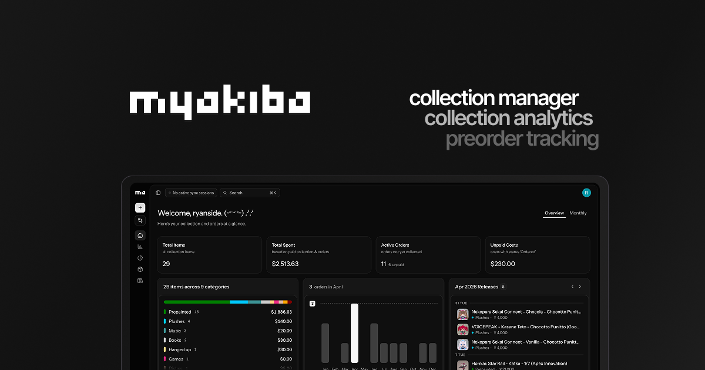
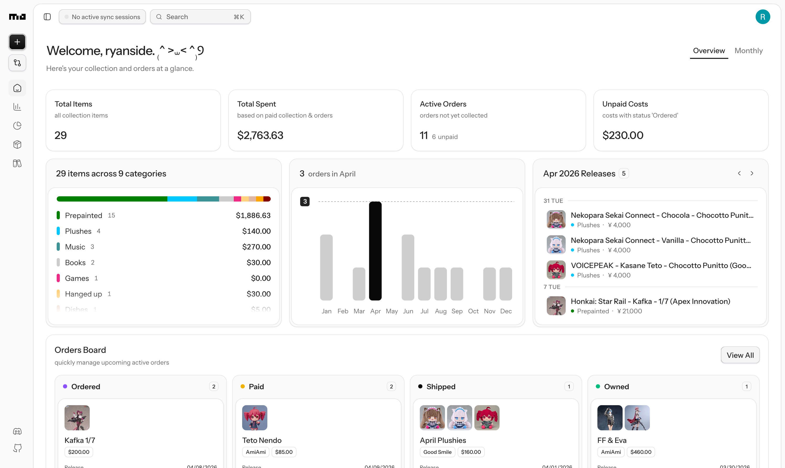
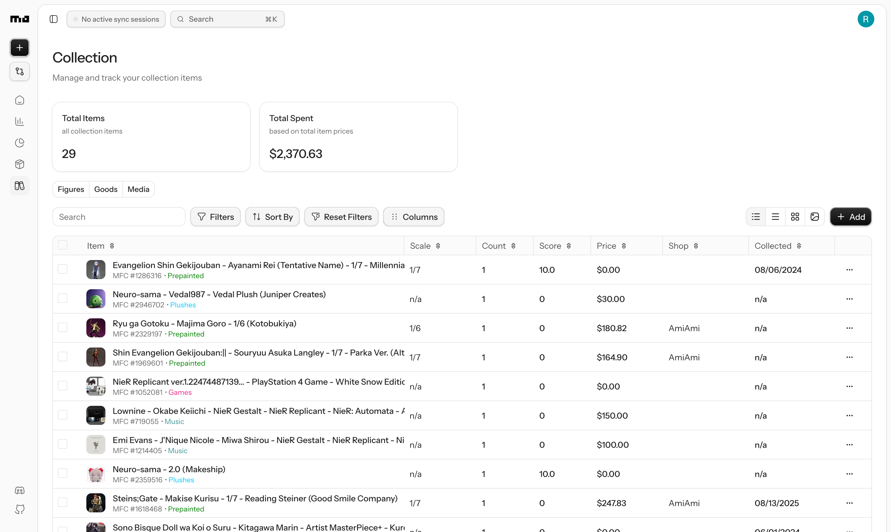
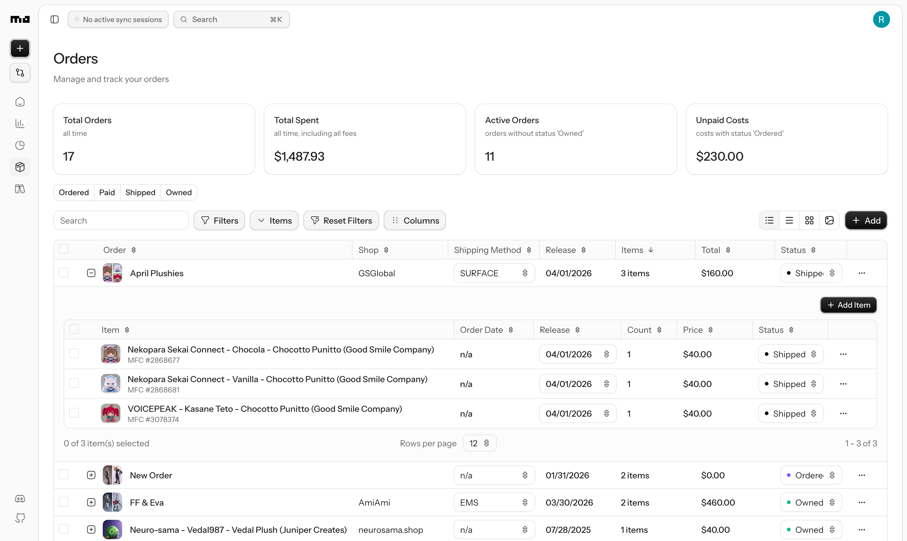
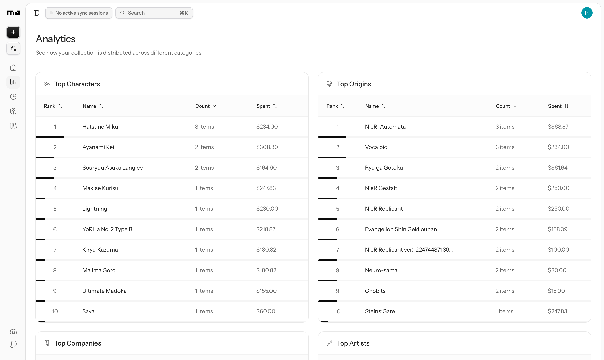

<div align="center">

  <h1>myakiba.app</h1>

</div>

<div align="center">

  <a href="https://discord.gg/VKHVvhcC2z" target="_blank">
    
  </a>
  

</div>

<br />

**[myakiba](https://myakiba.app)** is a collection management tool for collectors of Japanese media and collectables. Track your collection, manage orders, view insightful analytics, and stay organized with an intuitive and modern interface.

Early in development.



The community-powered catalog from **MyFigureCollection** and the flexibility of spreadsheets, coupled with new and convenient features for collectors, unified into one collection management tool.

## Motivation

- MyFigureCollection’s collection manager felt limited and its UI/UX dated, but it has the most comprehensive database for collectors.
- Spreadsheets are flexible and easy to edit, but they’re fragmented and don’t provide real item data or a unified platform.
- New collection tools have appeared, but most still rely on users manually entering item information.

I wasn’t satisfied with any of these options as a collector, so I built my own.

## Features

### Core Features

- **Collection Management** - Organize and track your entire figure collection with detailed item information from MyFigureCollection
- **Order Management** - Manage pre-orders, track shipments, and monitor order status
- **Analytics** - Visualize spending patterns, collection statistics, and trends
- **Expense Tracking** - See exactly where your money goes: item prices, shipping, taxes, and fees.
- **Budget Control** - Compare what you’ve spent against the budget you set for yourself
- **Personalized Profile** - Share your stats, analytics, collection, and orders with your friends through your customizable profile page.

### Technical Stack

- **TypeScript**
- **React (Vite)** - Frontend
- **TanStack Router, Query, Table, Form** - Major frontend tools
- **TailwindCSS & shadcn/ui** - Styling
- **Elysia** - Backend
- **Bun** - Runtime + package manager
- **Drizzle** - ORM
- **PostgreSQL** - Database
- **Redis** - Store for queues, caching, rate limiting, data
- **BullMQ** - Job queue for background processing and workers
- **Betterauth** - Authentication
- **AWS S3** - Object storage
- **Turborepo** - Monorepo

## Page Showcase

### Dashboard

Get a comprehensive overview of your collection at a glance. Monitor your spending and expenses, view upcoming releases, quickly manage orders, and more all in one central hub.

<div align="center">



</div>

### Collection

Manage your entire collection with a powerful data table. Filter, sort, and organize items easily. Track collection dates, prices, shops, and more. Inline editing makes updating your collection quick and efficient.

<div align="center">



</div>

### Orders

Keep track of all your orders and purchases in one place. Track payments (including shipping fees, taxes, tariffs, etc.), statuses, dates, shops. Manage multiple items per order. Customizable columns and filters.

<div align="center">



</div>

### Analytics

Dive deep into your collection data with comprehensive analytics. Visualize spending trends, analyze purchase patterns, track collection growth, and gain insights into your collecting habits.

<div align="center">



</div>

## Roadmap

myakiba is actively being developed with more features on the horizon:

- [ ] **Syncing with MFC simply by username**
- [ ] **Profile page**
- [ ] **Expense tracking**
- [ ] **More analytics**
- [ ] **Refining existing features**

## Self-host/Run Locally

### Prerequisites

- **Bun** (runtime + package manager)
- **PostgreSQL** (local install or Docker)
- **Redis** (Redis Stack recommended if you want the UI at `http://localhost:8001`)
- **AWS S3** (required for the worker’s image/object uploads)
- **HTTP proxy** (optional, used by the worker for scraping)

### Run locally

1. Clone the repository:

```bash
git clone https://github.com/ryanside/myakiba.git
cd myakiba
```

2. Install dependencies:

```bash
bun install
```

3. Set up your environment variables:

- Create a `.env` file in each app directory based on its `.env.example`:
  - `apps/server/.env` (API/auth/email/redis/db)
  - `apps/web/.env` (Vite client env, `VITE_*`)
  - `apps/worker/.env` (scraping/jobs/s3/redis/db)
- The typed env schemas live in `packages/env/src/*.ts`. At a minimum, you’ll need:
  - **Database**: `DATABASE_URL`
  - **Redis**: `REDIS_HOST`, `REDIS_PORT`
  - **Server**: `CORS_ORIGIN`, `BETTER_AUTH_SECRET`, `BETTER_AUTH_URL` (typically your API URL, e.g. `http://localhost:3000`), `TURNSTILE_SECRET_KEY`, `GOOGLE_CLIENT_ID`, `GOOGLE_CLIENT_SECRET`, `RESEND_API_KEY`, `RESEND_FROM_EMAIL`, `EARLY_ACCESS_PASSWORD`
  - **Web**: `VITE_SERVER_URL` (typically `http://localhost:3000`), `VITE_TURNSTILE_SITE_KEY`
  - **Worker**: `AWS_BUCKET_NAME`, `AWS_BUCKET_REGION`, plus credentials via `AWS_ACCESS_KEY_ID` and `AWS_SECRET_ACCESS_KEY` (and optional `HTTP_PROXY`)

4. Apply the database schema:

Start Postgres first (choose one):

- **Docker (provided)**:

```bash
bun db:start
```

- **Your own Postgres**: set `DATABASE_URL` accordingly.

Start Redis (example using Redis Stack):

```bash
docker run -d --name redis-stack -p 6379:6379 -p 8001:8001 redis/redis-stack:latest
```

Then push the schema:

```bash
bun db:push
```

5. Start the dev processes:

```bash
bun dev
```

6. Open [http://localhost:3001](http://localhost:3001) in your browser to see the web application.

The API is running at [http://localhost:3000](http://localhost:3000).

### Self-host (Docker Compose)

The root `docker-compose.yml` can run Postgres + Redis + API + workers.

1. Create a root `.env` file (used by Docker Compose) based on `.env.example`.

2. Build and start the stack:

```bash
docker compose up -d --build
```

## Project Structure

```
myakiba/
├── apps/
│   ├── web/            # Frontend (Vite + React + TanStack Router)
│   ├── server/         # Backend API (Elysia + Bun)
│   └── worker/         # Background jobs/scraping (BullMQ)
├── packages/
│   ├── auth/           # Better Auth config + adapters/plugins
│   ├── config/         # Shared TS config
│   ├── constants/      # Shared constants (categories/currencies/etc.)
│   ├── db/             # Drizzle schema + migrations + db scripts
│   ├── env/            # Typed env schemas (server/web/worker)
│   ├── eslint-config/  # Shared ESLint configuration
│   ├── types/          # Shared TS types
│   ├── utils/          # Shared utilities
│   └── validations/    # Shared zod validations
├── docker-compose.yml  # Self-host stack (API + workers + Postgres + Redis)
└── turbo.json          # Turborepo task pipeline
```

## Contributors

<a href="https://github.com/ryanside/myakiba/graphs/contributors">
  
</a>

Made with [contrib.rocks](https://contrib.rocks).

### Interested in Contributing?

Contributions are welcome! Please feel free to submit a Pull Request.

# Star History

<p align="center">
  <a target="_blank" href="https://star-history.com/#yourusername/myakiba&Date">
    <picture>
      <source media="(prefers-color-scheme: dark)" srcset="https://api.star-history.com/svg?repos=ryanside/myakiba&type=Date&theme=dark">
      
    </picture>
  </a>
</p>
